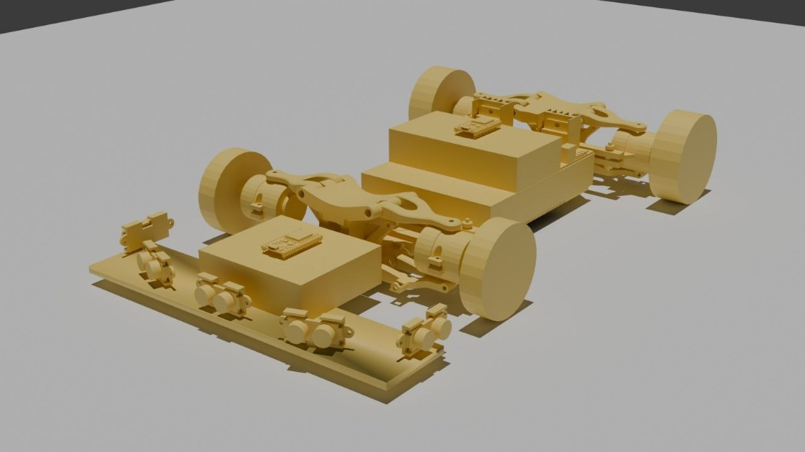
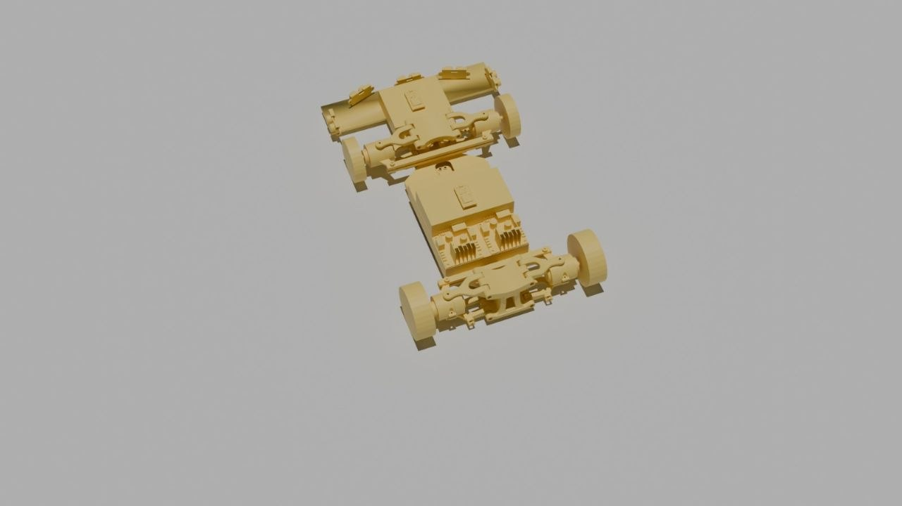
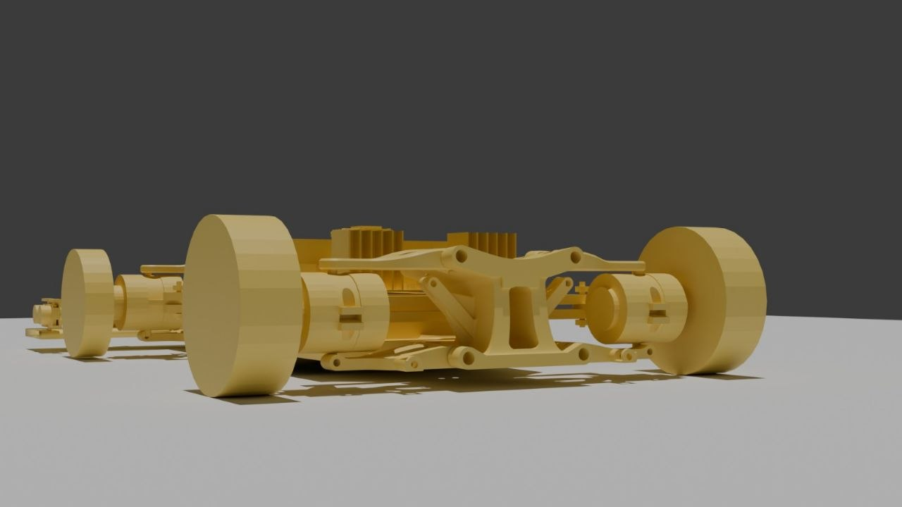
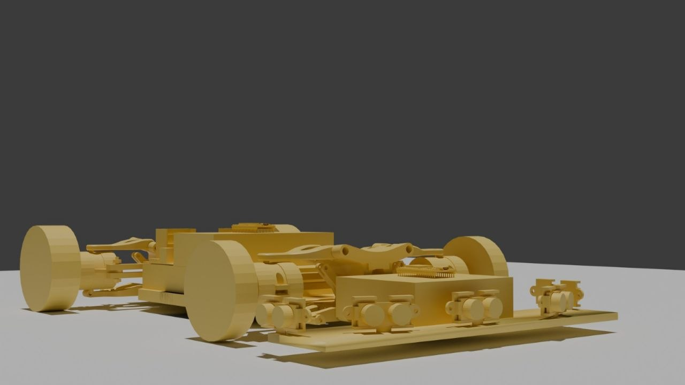
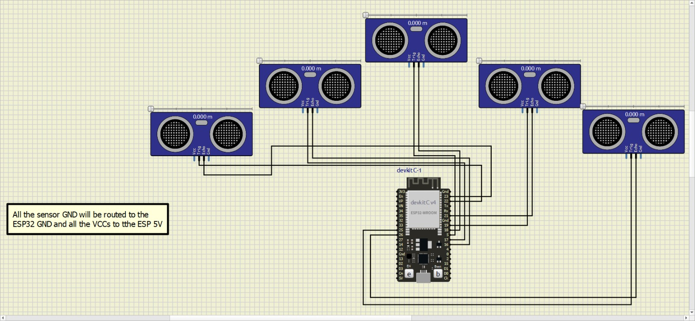
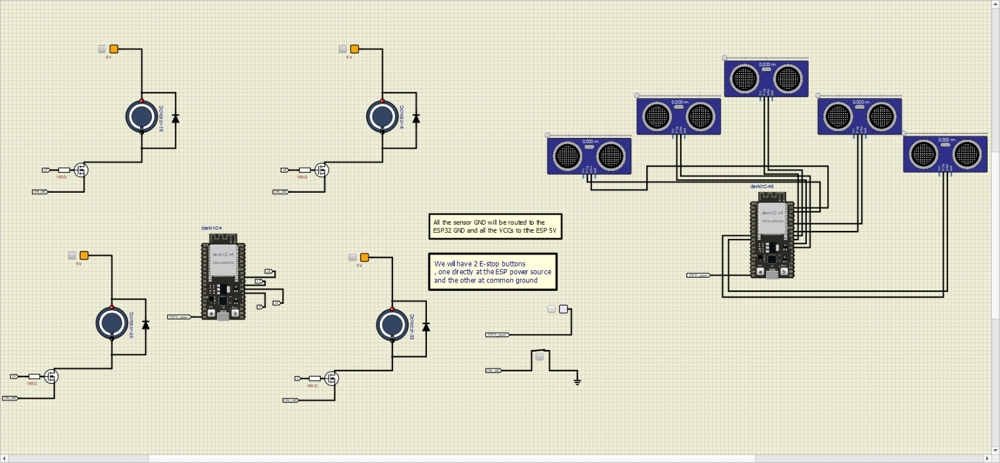
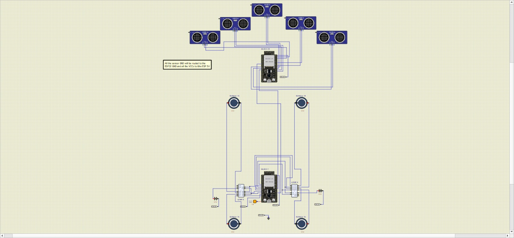
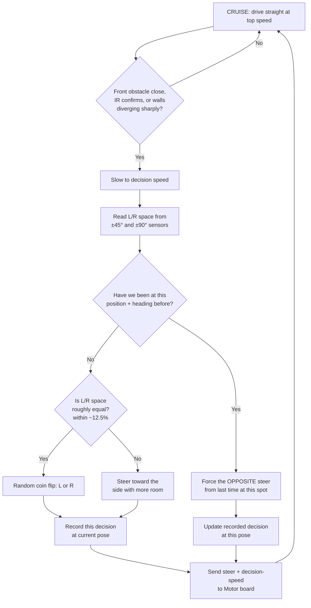

# Enigma — Talos
### Robo Grand Prix — Holistic Build Document

*Figures and details marked with an asterisk (\*) are the team's
current best estimates as of the Elimination Round, and are subject to
refinement in later rounds pending final component and design
confirmation.*

---

## Context & Problem Statement

Robo Grand Prix requires an autonomous robot capable of navigating a
tunnel-style track — walls on both sides with static obstacles placed
along the path — without human control, while respecting the
competition's weight and arena constraints.

The competition enforces a **5kg weight limit**. Talos's 4kg\* target
leaves a comfortable margin under that limit, even accounting for final
weight additions like wiring, mounting hardware, and battery choice.

Talos is designed against a target of **~30cm × 15–20cm footprint\***
and **4kg weight\*** — kept deliberately light and compact to maximise
manoeuvring room on a tunnel-style track and stay comfortably within
typical competition weight allowances.

## Solution Overview

Talos is a 4-wheel skid-steer robot that navigates by comparing open
space on its left and right using a 5-sensor ultrasonic array, steering
toward whichever side has more room, and slowing down whenever it needs
to make a decision. To avoid getting stuck circling the same section of
track, it tracks its own position and is forced to pick a different
direction if it detects it has returned to a spot it already decided at
before. The system is split across two ESP32 boards — a Sensor board
that makes all the decisions, and a Motor board that just executes
whatever it's told — so that the safety-critical motor control stays
simple and isolated from the decision logic.

## BOM Summary

Full costed Bill of Materials with sourcing links:
[Bill of Costs](https://github.com/enneji022/Project-Talos/blob/main/DOCUMENTATION/Bill%20of%20cost.xlsx)

| Category | Core Item | Qty |
|---|---|---|
| Compute | ESP32 Dev Board (WROOM-32) | 2 |
| Motor Control | L298N Dual H-Bridge Driver | 2 |
| Sensing — Distance | HC-SR04 Ultrasonic Sensor | 5 |
| Sensing — Orientation | MPU6050 6-DOF IMU | 1 |
| Sensing — Backup | IR Obstacle Sensor | 2 |
| Drive | 12V 30RPM DC Gear Motor | 4 |
| Drive | 60×25mm Robot Wheel | 4 |
| Safety | Emergency Stop Push Button | 1 |
| Safety | RF Remote E-Stop Relay | 1 |
| Power | 12V Battery | 2 |

**Estimated total: ~R2,640** (roughly R500 confirmed at current pricing,
~R2,140 still estimated pending final sourcing — see BOM for detail).

---

## Mechanical Design Section

**Fabrication method\*:** the chassis and mounting plates are planned
for 3D printing using the university's printers, pending confirmation
if the team advances past the elimination round.

Talos uses a 4WD skid-steer chassis with independent front and rear
axle assemblies. The CAD design (below) shows the wheel/motor mounting
brackets, the central chassis body carrying the two ESP32 boards, and
the forward sensor mounting plate holding the 5-sensor ultrasonic
array.

The 5 ultrasonic sensors are mounted across the front of the chassis:
one facing directly forward at 0°\*, two at ±45°\*, and two at ±90°\*,
giving close to full forward-hemisphere coverage for obstacle and wall
detection.

## Electronic Design Section

**Hardware choices:**
- **2× ESP32 (WROOM-32)** — one dedicated to sensing/decision-making
  (the "Sensor board"), one dedicated purely to motor execution (the
  "Motor board"), linked by UART. Splitting the roles keeps the
  safety-critical motor control simple and isolated from the more
  complex decision logic.
- **2× L298N dual H-bridge drivers** — one per side, giving independent
  left/right control for the 4-motor skid-steer layout.
- **5× HC-SR04 ultrasonic sensors** — front-facing array for
  wall/obstacle distance sensing, read sequentially (not simultaneously)
  to avoid ultrasonic cross-talk between sensors.
- **MPU6050 IMU** — gyroscope heading tracking, used for position
  estimation (see Programming section).
- **2× IR obstacle sensors** — close-range backup confirmation layer
  alongside the ultrasonic array.

**E-Stop integration (mandatory):** Talos uses a dual-redundant
emergency stop — one button wired directly at the ESP32 power source,
and a second at the system's common ground — confirmed in the circuit
design below. Cutting the common ground stops every board
simultaneously, rather than relying on one board to notice and shut
down gracefully. The Motor board firmware additionally senses the
e-stop line in software and refuses to command any motor movement
while it's active, as a secondary software-level check on top of the
hardware cut.

## Programming & Framework Design Section

Talos's decision-making logic is called **NAMI** (Navigational
Avoidance and Manoeuvrability Interface). Full writeup and flowchart:
`Folder A/sensor_board/ALGORITHM.md`.

**Software architecture:** the Sensor board runs a simple loop each
cycle: read all 5 ultrasonic sensors + IR backup, update the robot's
estimated position, run NAMI's decision logic, and send a drive command
to the Motor board over UART. The Motor board's firmware is
deliberately "dumb" — it just executes whatever command it receives,
with its own independent safety timeout that stops the motors if no
command arrives for 500ms.

**Core logic:**
- **Default:** cruise straight ahead at top speed.
- **Trigger:** when the front sensor detects an obstacle, or the two
  ±90° sensors show a sharply diverging reading (indicating a corner),
  slow down and enter decision mode.
- **Decision:** compare blended left-side vs right-side sensor
  readings and steer toward whichever side has more open space; if
  the two sides are within ~12.5% of each other, pick randomly rather
  than stall on an ambiguous reading.
- **Loop-prevention:** the robot estimates its own position using
  gyroscope heading plus wheel-encoder distance (dead reckoning). If it
  detects it has returned to a position where it made a decision
  before, it is forced to pick the opposite direction this time,
  preventing it from getting stuck circling the same section
  indefinitely. **This feature is implemented in firmware and
  code-reviewed against spec; final wheel-encoder confirmation on the
  production motors is still pending\*.**

**Verification:** the Sensor board firmware was built with PlatformIO
(zero errors, 6.8% RAM / 23.8% flash used) and run in the Wokwi
simulator, confirmed transitioning correctly between `[CRUISE]` and
`[DECISION]` states in response to simulated sensor input (see
`Folder A/sensor_board/test-evidence.png`). The Motor board firmware
was independently built and compiles cleanly against the same
codebase.
