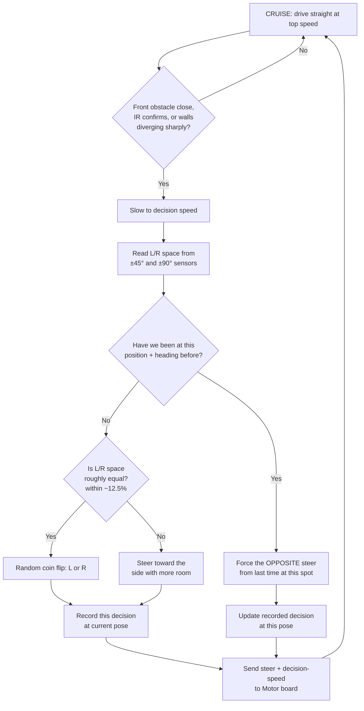

# NAMI — Navigational Avoidance and Manoeuvrability Interface

NAMI runs on the Sensor board (the "decision brain"). It decides *where* to
steer; the Motor board just executes whatever command it's sent.

## Summary

- **Default:** cruise straight ahead at top speed.
- **When something needs a decision** (an obstacle ahead, or a corner where
  the walls diverge/one wall disappears): slow down, then choose a path.
- **Path choice:** compare how much open space the 5 ultrasonic sensors see
  on the left vs the right, and steer toward the more open side.
- **Ties:** if left and right space are within ~12.5% of each other, flip a
  coin — don't overthink a decision the sensors can't confidently make.
- **Loop prevention:** the robot tracks its own position (IMU heading +
  wheel-encoder distance). If it ends up back at a spot it's already made a
  decision at, it's forced to pick the *opposite* of what it picked last
  time there — otherwise it could steer itself into an infinite loop on a
  symmetric track section.

## Flowchart

## Why position tracking isn't "just the IMU"

An accelerometer alone can't give reliable position — integrating
acceleration twice to get distance accumulates drift so fast it's unusable
within seconds. Instead, NAMI estimates position by **dead reckoning**:
heading comes from integrating the IMU's gyroscope (stable over a race-length
timescale), and distance traveled comes from wheel-encoder ticks reported by
the Motor board over UART. Position = heading direction × distance traveled,
accumulated over time. This is the standard technique small robots use for
short-range localization without GPS.

## Tunable constants (see `src/config.h`)

| Constant | What it controls | Starting value |
|---|---|---|
| `OBSTACLE_TRIGGER_CM` | front distance that forces a decision | 40 cm |
| `CORNER_DIVERGENCE_CM` | L90/R90 gap that reads as "corner" | 60 cm |
| `TIE_BREAK_PCT` | how close L/R space must be to count as a tie | 12.5% |
| `LOOP_RADIUS_CM` | how close a position must be to count as "the same spot" | 15 cm |
| `LOOP_HEADING_TOL_DEG` | how close heading must be to count as "the same spot" | 30° |

All of these are explicitly called out as "confirm/tune once testing starts"
in the team's own algorithm description — expect to adjust them once you see
real sensor noise on the actual hardware.
